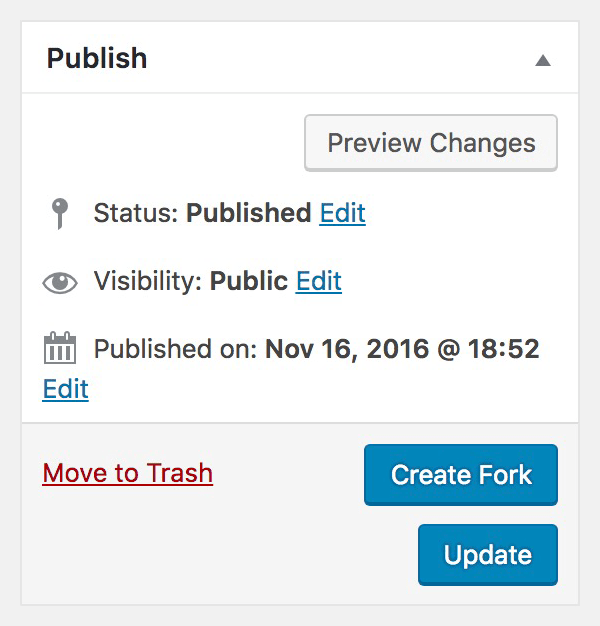
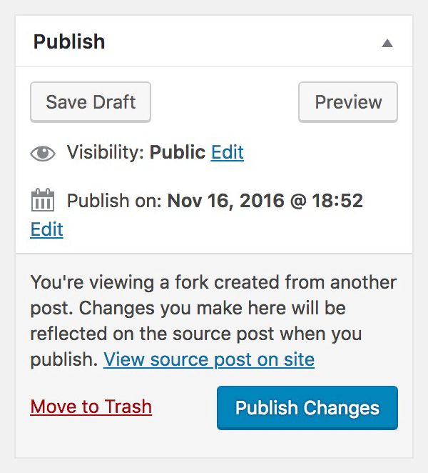
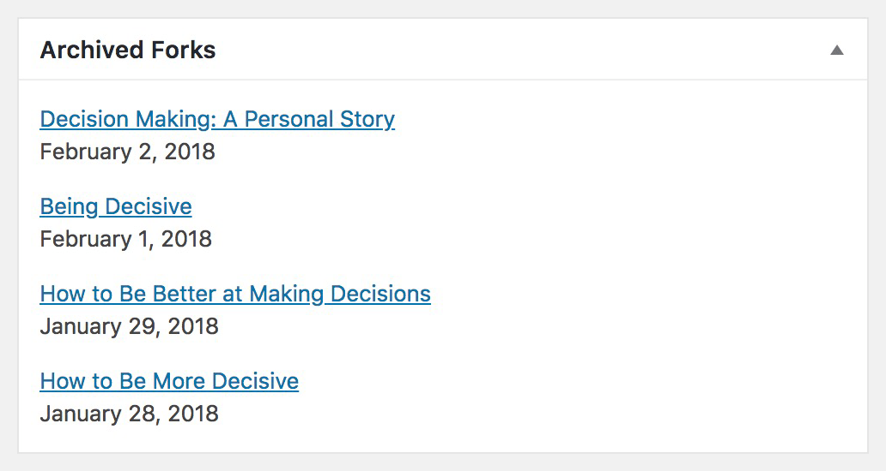
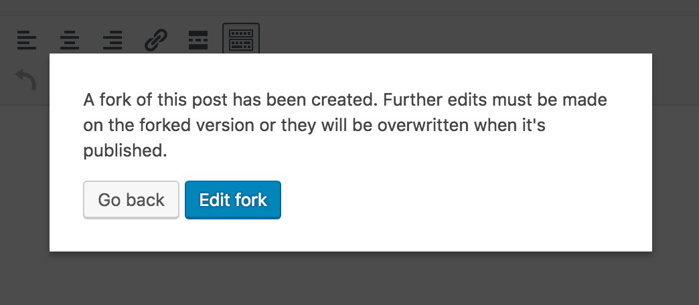

WP Safe Edit
========

Safely edit published posts behind the scenes without affecting the live site. You can save your changes as a draft and publish them when ready, so you don't have to finish your updates in one sitting. This gives editors the opportunity to collaborate on changes or get approval before publishing.

## Requirements

* **WordPress >= 4.5** due to the use of `get_post_types_by_support()`
* **PHP >=5.4**

## Installation

1. Download and activate the plugin in WordPress.

2. Register safe edit functionality for one or more post types:

```php
do_action( 'safe_edit_add_post_type_support', array( 'post', 'page' ) );
```

## Usage

1. When this plugin is installed, a **"Create Fork"** button [Fig. 1] will be available for the post types you registered support for. Pressing this button will create a draft copy of the post where you can stage your changes. All post meta and taxonomy terms associated with the post will be included.<br><br>
<br>
_Figure 1._

2. When editing a fork, it functions like any other post so you can do the following:
   * **Save Changes as a Draft:** Changes saved as a draft will not be reflected on the live site until you publish them.
	 
   * **Preview Changes:** Preview your changes at any time by pressing the **"Preview"** button.
   
   * **Trash Changes:** If you change your mind, you can trash your updates by pressing the **"Move to Trash"** link.

3. Once you're happy with your changes, publish them by pressing the **"Publish Changes"** button [Fig. 2]. The post you created the fork from will be updated with your changes and reflected on the live site.<br><br>
<br>
_Figure 2._

## Viewing Previous Forks

You can view the most recent forks created for a post using the **"Archived Forks"** meta box [Fig. 3]. Unlike WordPress revisions, all content, terms, and meta data are retained so you can see what the fork looked like when it was published.<br><br>
<br>
_Figure 3._

## Caveats & Limitations

1. This plugin isn't compatible with post types using Gutenberg yet.

2. You cannot edit a post in the dashboard if an open fork exists for it because the changes would be overwritten when the fork is published; a lockout message is shown if you try [Fig. 4]. **Note:** It's still possible to edit the post through an API or code, so consider that before enabling support. A planned improvement is to interrupt the publish fork process when the source post has been modified since the fork was created.<br><br>
<br>
_Figure 4._

3. If a post type contains meta boxes that save data behind the scenes using AJAX, you may need to hook into the publish fork process to make adjustments. Consider the following scenario:

   1. You create a fork of a post.
   2. On the fork, you use a meta box that creates an associated post in the background using AJAX. The associated post references the fork's post ID.
   3. You publish the fork.
   4. The source post has been updated with the changes from the fork, but the associated post you created still references the fork's post ID. To resolve this, adjustments to the associated post needs to be made during the fork publishing process using either the `safe_edit_before_merge_post` or `safe_edit_after_merge_post` action.

4. You cannot change a post's URL slug using a fork because forks are always published back to the source post retaining the original URL.

## Roadmap

Some of the planned improvements are listed below:

- Compatibility with Gutenberg.

- Interrupt the publish fork process when the source post has been modified since the fork was created.

- Break up some of the more complex fork/merge functions.

- Complete unit tests.

- Show more than the last 10 archived forks.
